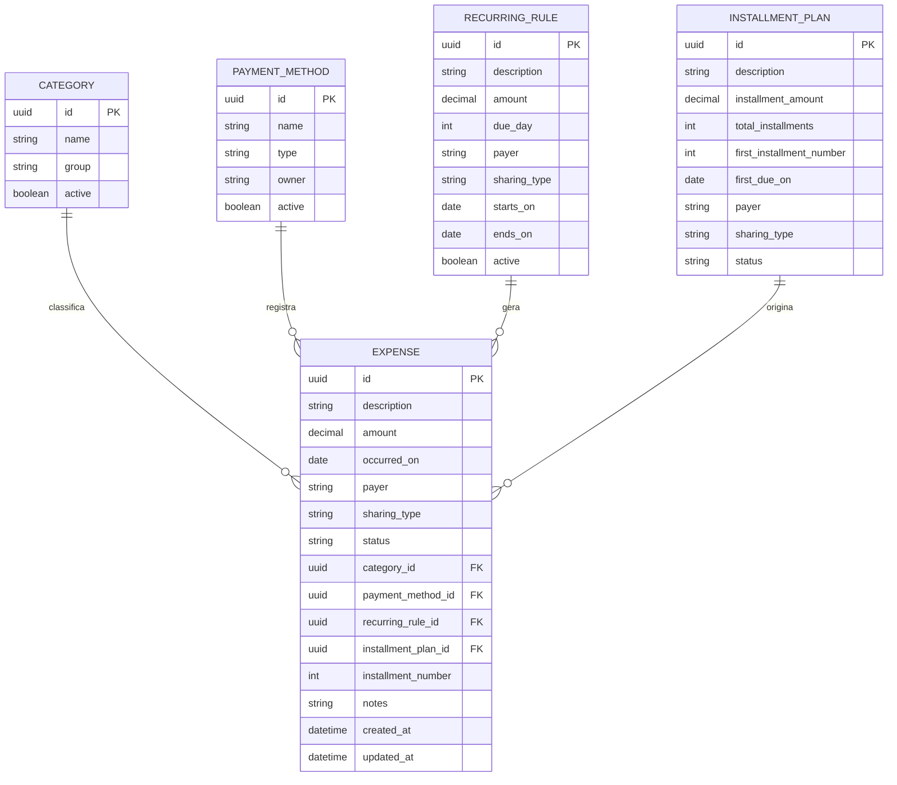

# Controle financeiro da casa — Fase 1

## Objetivo

Substituir a planilha mensal por um aplicativo web compartilhado para registrar despesas da casa, acompanhar compromissos futuros e fechar o saldo entre as duas pessoas fixas do sistema: **Matheus** e **Karina**.

## Decisões confirmadas

- O sistema terá sempre exatamente duas pessoas: Matheus e Karina.
- Não existirá tela para cadastrar, excluir ou convidar participantes.
- A moeda inicial é Real brasileiro (BRL).
- Cada lançamento terá um único pagador.
- Uma despesa pode ser compartilhada ou individual.
- A divisão padrão de uma despesa compartilhada é 50% para cada pessoa.
- O fechamento mensal calcula o acerto líquido; o app não executa transferências bancárias.

## Escopo do MVP

### Lançamentos

Criar, editar, excluir e consultar despesas com os seguintes dados:

| Campo | Regra |
| --- | --- |
| Descrição | Obrigatória; por exemplo, `Aluguel`, `Ração` ou `BeMais` |
| Valor | Obrigatório, maior que zero, em BRL |
| Data da despesa | Obrigatória; define o mês de competência |
| Categoria | Obrigatória |
| Pagador | `MATHEUS` ou `KARINA` |
| Natureza | `COMPARTILHADA` ou `INDIVIDUAL` |
| Método de pagamento | Opcional: cartão ou conta/dinheiro |
| Status | `PENDENTE` ou `PAGO` |
| Observação | Opcional |

### Categorias iniciais

- Moradia: aluguel, condomínio, energia, internet
- Mercado e alimentação
- Transporte e combustível
- Cadelas: ração, banho, creche, consulta, medicamentos e acessórios
- Lazer e fim de semana
- Assinaturas
- Saúde e bem-estar
- Viagens
- Outros

### Fechamento mensal

Para um mês selecionado, a aplicação deve mostrar:

1. total de despesas compartilhadas;
2. responsabilidade de Matheus e de Karina nas despesas compartilhadas;
3. quanto cada pessoa efetivamente pagou em despesas compartilhadas;
4. despesas individuais, apenas como informação, sem entrar no acerto;
5. saldo líquido e quem deve reembolsar quem.

## Regras de cálculo

Para cada despesa compartilhada de valor `V`:

- responsabilidade de Matheus: `V × 50%`;
- responsabilidade de Karina: `V × 50%`;
- o valor total `V` é inicialmente atribuído ao respectivo pagador.

No fechamento mensal:

```text
saldo de Matheus = total compartilhado pago por Matheus - responsabilidade de Matheus
saldo de Karina  = total compartilhado pago por Karina - responsabilidade de Karina
```

- Saldo positivo: a pessoa antecipou valores e deve receber.
- Saldo negativo: a pessoa deve reembolsar.
- O valor do acerto é o módulo de um dos saldos; os saldos devem ser opostos.
- Despesas `INDIVIDUAL` não afetam o acerto.

Exemplo: Karina paga aluguel de R$ 3.900,00 e Matheus paga internet de R$ 100,00. A despesa compartilhada total é R$ 4.000,00; cada pessoa é responsável por R$ 2.000,00. Karina pagou R$ 3.900,00 e Matheus R$ 100,00, portanto Matheus deve R$ 1.900,00 para Karina.

## Contas recorrentes e parcelas

Estes recursos entram após o fluxo básico de lançamento, mas o modelo já deve suportá-los:

- **Recorrência:** conta mensal que gera um lançamento previsto, como aluguel, Netflix ou internet.
- **Parcelamento:** compra com valor, número de parcelas, parcela atual e mês de vencimento de cada parcela.
- Lançamentos gerados devem continuar editáveis sem alterar o histórico anterior.

## Modelo de dados proposto



### Valores controlados

```text
Person: MATHEUS | KARINA
SharingType: COMPARTILHADA | INDIVIDUAL
ExpenseStatus: PENDENTE | PAGO
PaymentMethodType: CARTAO | CONTA | DINHEIRO | OUTRO
```

`Person` será uma enumeração fixa na aplicação, e não uma tabela. Isso garante a regra de apenas duas pessoas em todas as telas e cálculos.

## Critérios de aceite da Fase 1

- As regras de divisão e de acerto mensal estão documentadas e sem depender de fórmulas de planilha.
- Matheus e Karina são os únicos pagadores possíveis.
- A estrutura contempla os dados presentes na planilha: categorias, cartões, recorrências, parcelas e status de pagamento.
- O escopo do MVP está separado de melhorias posteriores.

## Próxima fase

Criar o projeto web, banco PostgreSQL e a primeira versão do cadastro/listagem de despesas, usando este documento como contrato funcional.
